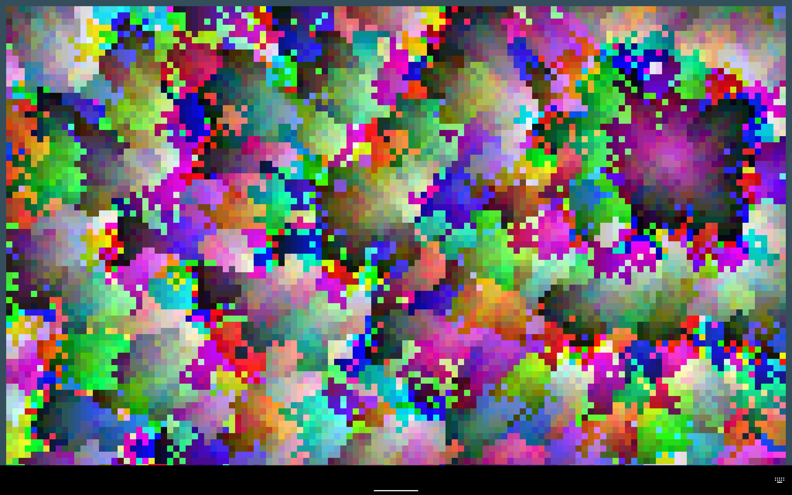
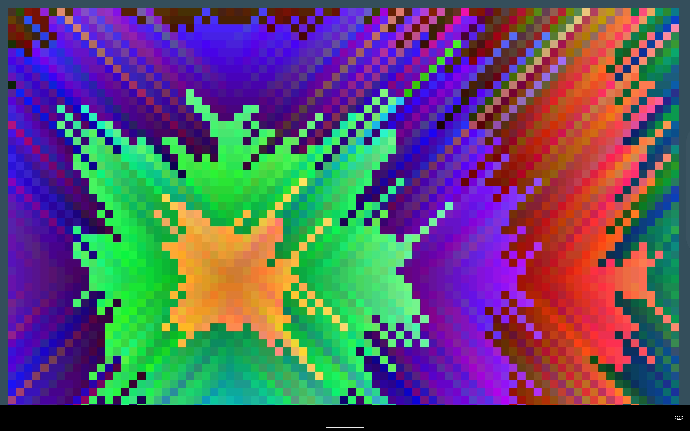
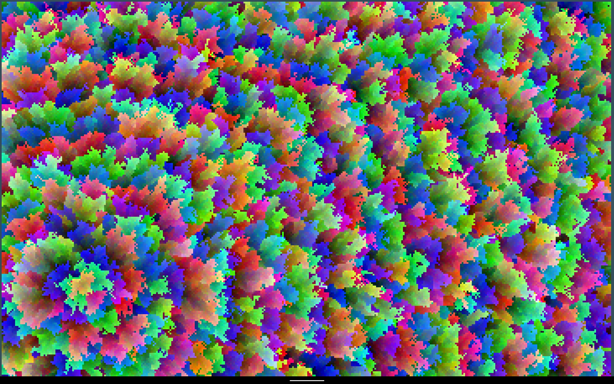

# PixelArt Generator

**Número da Lista**: X 
**Conteúdo da Disciplina**: Grafos 1 

## Alunos
|Matrícula | Aluno |
| -- | -- |
| 18/0121995  |  Herick de Carvalho Lima |
| 19/0054832  |  Arthur Talles de Sousa Cunha |

## Sobre 
Este projeto tem por objetivo a criação de um jogo no qual o usuário seleciona um ponto da tela a partir do qual uma arte abstrata será gerada seguindo as opções por ele indicadas previamente (tipo de algoritmo de grafos usado para a geração da imagem, o grau de variação das cores, dimensão dos blocos de pixels e a seleção, aleatória ou não, de vizinhos). 

## Screenshots

## Instalação 
**Linguagem**: Python 
<!---
**Framework**: (caso exista) 
Descreva os pré-requisitos para rodar o seu projeto e os comandos necessários.
-->
## Uso 
Para utilizá-lo é necessário:

1. Clonar o repositório

    SSL:
    $ git clone git@github.com:projeto-de-algoritmos/Grafos1_pixelArtGenerator.git
    
    HTTPS:
    $ git clone https://github.com/projeto-de-algoritmos/Grafos1_pixelArtGenerator.git

2. Instalar o Python

    $ sudo apt-get install python3

3. Instalar a biblioteca pygame
   
    pip install pygame

3. Executar em sua máquina
   
    python3 main.py
<!---
## Outros 
Quaisquer outras informações sobre seu projeto podem ser descritas abaixo.
--->

